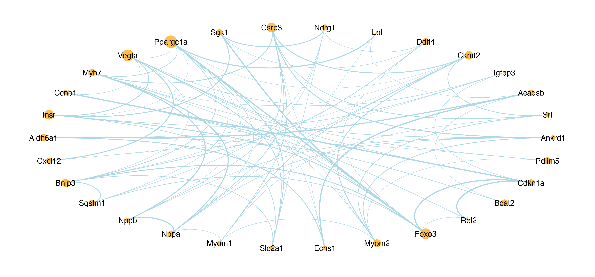
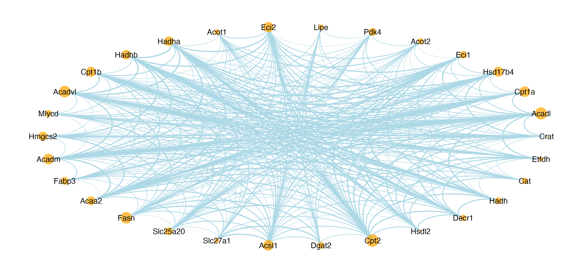

# Transcriptome-Explorer
A comprehensive RNA-Seq data analysis pipeline

This project encompasses a comprehensive pipeline for analyzing RNA-Seq data, focusing on the identification of differentially expressed genes using DESeq2 and Limma and subsequent functional enrichment analysis. The script takes raw count data as input, normalizes it, and applies rigorous statistical methods to detect differentially expressed genes. Subsequently, it leverages various R packages to conduct functional enrichment, aiming to unravel the biological implications of the differential expression. The script also includes visualization tools to produce clear, interpretable plots of the data and results.


# Installation Guide

## Prerequisites

This script requires R (version 3.6 or later) and several R packages. Make sure you have R installed on your system. If you do not, you can download it from [The Comprehensive R Archive Network (CRAN)](https://cran.r-project.org/).

## Cloning the Repository

To get the script on your local machine, clone the repository from GitHub. Open your terminal and run the following command (replace "your-repository-url" with the URL of your GitHub repository):

```
git clone your-repository-url
```

This will create a copy of the repository in your local machine.

## Installing R Packages

The script requires several R packages. Here's how to install them:

Open R or RStudio, and run the following commands:

```R
packages <- c("DESeq2", "pheatmap", "tidyverse", "cowplot", "Matrix.utils", "edgeR", "dplyr", "magrittr", 
"Matrix", "purrr", "reshape2", "S4Vectors", "tibble", "apeglm", "png", "RColorBrewer", "optparse", "limma", 
"edgeR", "openxlsx", "ggplot2", "ggrepel", "clusterProfiler", "enrichplot", "gprofiler2", "ggplot2", "enrichR", 
"tidyverse", "STRINGdb", "igraph")

install.packages(setdiff(packages, rownames(installed.packages())))
```

The script will automatically install any package in the list that is not already installed.

## Running the Script

To run the script, navigate to the directory containing the script file (`Transcriptome-Explorer.R`) in the bash terminal, then source the script:

```
"Rstript Transcriptome-Explorer.R -h"
```

## Script Options

The script supports the following command-line options:

| Option | Description |
| --- | --- |
| `-c CHARACTER, --counts=CHARACTER` | Counts matrix file |
| `-f CHARACTER, --samplefile=CHARACTER` | Sample file |
| `-b CHARACTER, --background=CHARACTER` | Background gene list file (e.g. all/no/a list of genes) |
| `-t CHARACTER, --tool=CHARACTER` | Tool selection (DESeq2/Limma), default=DESeq2 |
| `-d CHARACTER, --datatype=CHARACTER` | Data type (raw/norm), default=raw |
| `-g CHARACTER, --groupnames=CHARACTER` | Group names (e.g., condition,wt,ko) |
| `-p NUMERIC, --pvalue=NUMERIC` | P-value cutoff, default=0.05 |
| `-q NUMERIC, --fdr=NUMERIC` | FDR cutoff, default=0.05 |
| `-F NUMERIC, --foldchange=NUMERIC` | Fold change cutoff, default=0.58 |
| `-T INTEGER, --top=INTEGER` | Number of top DEGs, default=20 |
| `-D CHARACTER, --formula=CHARACTER` | Design formula, e.g. ~sex + age + treatment |
| `-P CHARACTER, --plottype=CHARACTER` | Plot type (png/pdf/svg) |
| `-r REFERENCE, --reference=REFERENCE` | Reference genome, can be 'mouse' or 'human' |
| `-m MISSING_OPTION, --missing_option=MISSING_OPTION` | |
| `-h, --help` | Show help message and exit |

Please replace the placeholders (e.g., `CHARACTER`, `NUMERIC`, `INTEGER`, `REFERENCE`, `MISSING_OPTION`) with your actual values when running the script.

example:
```
Rscript Transcriptome-Explorer.R -c NormCounts.xlsx -f samplefile.xlsx -b no  -g "condition,KO,WT" -D  "~ age + condition" -P png -F 0.2 -q 0.6 -T 10 -d norm
```

## Output Files Description

1. `upregulated_genes.csv`: A CSV file containing a list of genes that are significantly upregulated under the conditions of your experiment.

2. `downregulated_genes.csv`: A CSV file containing a list of genes that are significantly downregulated under the conditions of your experiment.

3. `all_results.csv`: A CSV file containing the complete results of the differential expression analysis. This includes all tested genes, not just those that are significantly differentially expressed.

4. `sig_genes.csv`: A CSV file containing a list of genes that are significantly differentially expressed, either upregulated or downregulated, under the conditions of your experiment.

5. `go_result_all.csv`: A CSV file containing the results of the Gene Ontology (GO) enrichment analysis for all significantly differentially expressed genes.

6. `go_result_up.csv`: A CSV file containing the results of the GO enrichment analysis for the significantly upregulated genes.

7. `go_result_down.csv`: A CSV file containing the results of the GO enrichment analysis for the significantly downregulated genes.

8. `kegg_result_all.csv`: A CSV file containing the results of the KEGG pathway enrichment analysis for all significantly differentially expressed genes.

9. `kegg_result_up.csv`: A CSV file containing the results of the KEGG pathway enrichment analysis for the significantly upregulated genes.

10. `kegg_result_down.csv`: A CSV file containing the results of the KEGG pathway enrichment analysis for the significantly downregulated genes.

11. `network_all.csv`: A CSV file containing the gene-gene interaction network for all significantly differentially expressed genes.

12. `network_up.csv`: A CSV file containing the gene-gene interaction network for the significantly upregulated genes.

13. `network_down.csv`: A CSV file containing the gene-gene interaction network for the significantly downregulated genes.

Each file provides a piece of the overall analysis and helps to interpret the biological significance of the results.

## Output Images Description

1. `PCA.png`: A PCA plot showing the clustering of samples based on their gene expression profiles.  
   

2. `volcano.png`: A volcano plot showing the results of the differential expression analysis. Each point represents a gene. The x-axis is the log2 fold change and the y-axis is the -log10 p-value. Genes with significant differential expression are colored.  
   

3. `topDEGs.png`: A bar plot showing the top differentially expressed genes.  
   

4. `heatmap_sample.png`: A heatmap showing the gene expression profiles of each sample.  
   

5. `heatmap_DEGs.png`: A heatmap showing the expression profiles of the differentially expressed genes.  
   

6. `heatmap_top10_up_down_genes.png`: A heatmap showing the expression profiles of the top 10 upregulated and downregulated genes.  
   

7. `go_result_top10_all.png`: A bar plot showing the top 10 enriched GO terms for all differentially expressed genes.  
   

8. `go_result_top10_up.png`: A bar plot showing the top 10 enriched GO terms for upregulated genes.  
   

9. `go_result_top10_down.png`: A bar plot showing the top 10 enriched GO terms for downregulated genes.  
   

10. `go_result_bp_all.png`: A bar plot showing the enriched biological process (BP) GO terms for all differentially expressed genes.  
   

11. `go_result_bp_up.png`: A bar plot showing the enriched BP GO terms for upregulated genes.  
   

12. `go_result_bp_down.png`: A bar plot showing the enriched BP GO terms for downregulated genes.  
   

13. `kegg_result_bar_all.png`: A bar plot showing the enriched KEGG pathways for all differentially expressed genes.  
   

14. `kegg_result_bar_up.png`: A bar plot showing the enriched KEGG pathways for upregulated genes.  
   

15. `kegg_result_bar_down.png`: A bar plot showing the enriched KEGG pathways for downregulated genes.  
   

16. `kegg_result_bubble_all.png`: A bubble plot showing the enriched KEGG pathways for all differentially expressed genes.  
   

17. `kegg_result_bubble_up.png`: A bubble plot showing the enriched KEGG pathways for upregulated genes.  
   

18. `kegg_result_bubble_down.png`: A bubble plot showing the enriched KEGG pathways for downregulated genes.  
   

19. `network_all.png`: A network plot showing the gene-gene interaction networks for all differentially expressed genes.  
   

20. `network_up.png`: A network plot showing the gene-gene interaction networks for upregulated genes.  
   

21. `network_down.png`: A network plot showing the gene-gene interaction networks for downregulated genes.  
   

22. `network_new_all.png`: An updated network plot showing the gene-gene interaction networks for all differentially expressed genes, based on further analysis or filtering.  
   

23. `network_new_up.png`: An updated network plot showing the gene-gene interaction networks for upregulated genes, based on further analysis or filtering.  
   

24. `network_new_down.png`: An updated network plot showing the gene-gene interaction networks for downregulated genes, based on further analysis or filtering.  
   


Follow the instructions in the script to input your data and run the analysis.

## Getting Help

If you encounter any issues or have any questions, please check the [GitHub Issues page](https://github.com/Kai6662/Transcriptome-Explorer/issues) for this repository. If you don't see your issue, feel free to open a new one. 

## Citation

If you use this workflow in your research, please cite this GitHub repository. Here is an example citation:

K. Cui (2023). Transcriptome-Explorer. GitHub. Available at: https://github.com/Kai6662/Transcriptome-Explorer


